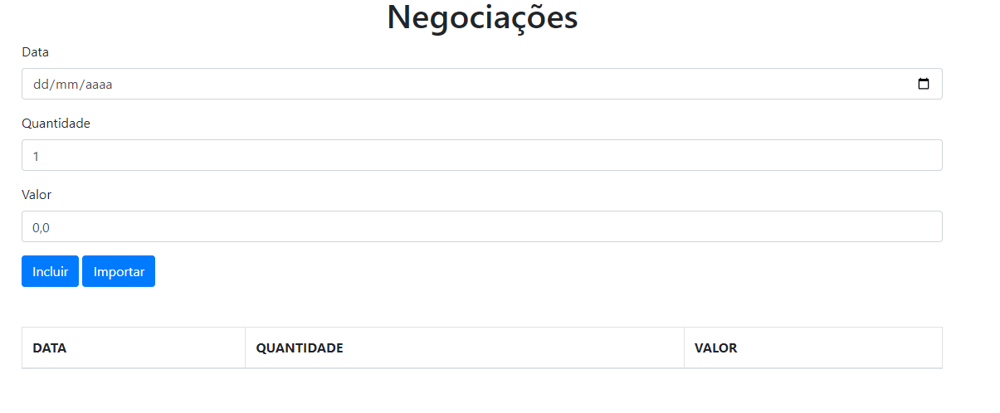

# FORMULÁRIO 

### Este Formulário foi desenvolvido utilizando typeScript com o objetivo de criar tabelas dinâmicas conforme dados fossem inserios nos campos do formulário onde continham 3 campos de input:

* data;
* quantidade;
* valor;

### Após o preenchimento dos campos haviam a opcão de dois botões:

* Incluir - Que após clicado dispara evento responsável por imprimir os valores na tabela da página;

* Importar - Que também imprimi valores na tabela, porém importa dados vindo de uma API externa;

